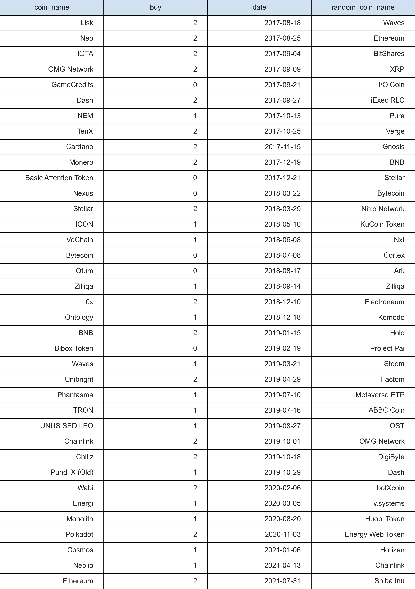

# Cryptocurrency profit analysis

## Important note

This analysis was made for fun and learning purposes. It's not an investment advice.
I'm just a person interested in this market but I'm not a professional. 
Remember that crypto market is very risky and volatile.

## Technology
The project was made in Python. Below is the list of libraries:
<ul>
<li>pandas</li>
<li>matplotlib</li>
<li>numpy</li>
<li>requests</li>
<li>json</li>
<li>math</li>
</ul> 

## Table of contents
1. Project overview
2. Data sources
3. Assumptions
4. Analysis
5. Conclusion
6. Further steps

## Project overview 

The project aims on measuring profit made by cryptocurrencies reviewed
by crypto youtuber Phil Konieczny. 

The hypothesis is the following:
It is more profitable to buy reviewed and recommended coins than buy random coins.

## Data sources

Cryptocurrency prices are collected from <a href="https://coinmarketcap.com/">
coinmarketcap.com
</a>

Phil Konieczny reviews you can find on the youtube playlist <a href=
"https://www.youtube.com/playlist?list=PL03G2FwOuZrwCdUdhiYJvWAIkoSezpEQs">here</a>

## Assumptions
<ul>
<li>Coins are bought exactly on each cryptocurrency review video release date</li>
<li>Coins are bought for 100 USD</li>
<li>All coins are sold on 31.12.2021</li>
<li>Random coins can be picked only from top 100 list based on market capitalization</li>
<li>Stable coins i.e. coins that mimic USD are excluded from analysis</li>
<li>Each random coin can be picked only once</li>
</ul>

## Analysis

The first step is to pick a random altcoin for each reviewed altcoin. 
The table below shows the information about altcoin, buy date (video release date),
random coin and information about buy status:

<ul>
<li>2 - invest</li>
<li>1 - unknown</li>
<li>0 - no invest</li>
</ul>

Let's see how many coins are in each group:

As you can see there are only 6 coins with "no invest" status and it's ~16.2%.
We exclude these 6 coins from analysis.

Now let's check what was the price of Bitcoin when reviewed and random altcoins were bought.
Below is the chart with Bitcoin prices from the first video to 31.12.2022. Red 
dots are dates when coins are bought.

Most of altcoins were bought before the bull run in 2021 / 2022 so 
it's likely to make good profit even if we buy random coins. But we are more 
interested in average profit made by random coins vs reviewed coins.

Let's check the profit from reviewed coins:

As you can see more than half reviewed altcoins made profit more than 0. 
There are 6 coins which made profit better than 2000%. The most profitable altcoin
made 8500% profit and it is Binance coin. 

Let's move to random coins:

The most profitable altcoin is Binance Coin again. There are 2 coins which made profit
better than 2000%. We can clearly see that profit from reviewed coins is better than 
profit from random coins. 

However we should remember that overall profit is still pretty good
and these altcoins were picked randomly without any research. Now let's count the
average profit made by random and reviewed coins:

The average profit from reviewed coins is 992% compared to 584% profit from random coins
which is 70% higher. This is the profit if we buy coins on dates where buy status is 
unknown or invest.

The average profit is better if we buy only recommended coins (1391%). 
It's 40% higher than the average profit for coins with buy status invest and unknown.
Random coins made on average 1012% profit which is again less than reviewed coins, but 
1000 USD profit from 100 USD investment is very good result.

The last step is to check Bitcoin profit:

As we can see the average Bitcoin profit is less than reviewed coins profit.
If Bitcoin were bought on dates with buy status invest or unknown, it made 
slightly better profit than random coins. However the difference is very small.

If we buy coins only on invest dates, the highest profit is from reviewed altcoins, 
then random altcoins and the lowest profit is made by Bitcoin (684%).
It's 50% less than reviewed coins and 32% less than random altcoins.

## Conclusion

The hypothesis that is better to buy reviewed and recommended coins is confirmed.
However the analysis showed that buying coins randomly led to very good profit also.
It's probably because most of the coins were bought when cryptocurrencies prices
were relatively small.

There are many altcoins which will lead to loss so it's very risky to invest in them.
On the other hand it's likely to generate higher profit from altcoins than from Bitcoin. 
However, these days Bitcoin has a very strong position on the cryptocurrency market - it's the 
most popular cryptocurrency, it's less volatile and probably more safe 
(in terms of investment) than other cryptocurrencies.

It's important to highlight that cryptocurrency market is very risky and volatile.
The overall market capitalization is strongly correlated to Bitcoin price. Usually
when Bitcoin grows, other cryptocurrencies grows too. Before deciding to buy
any cryptocurrency it's important to make own research and learn as much as possible 
about the market.

## Further steps
It's worth to consider analysis with coins outside top 100 list. Those coins will 
probably generate higher profit but the investment is more risky.